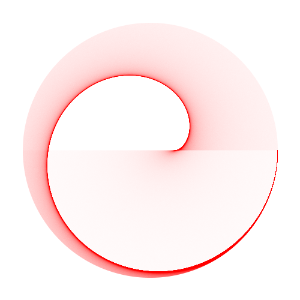
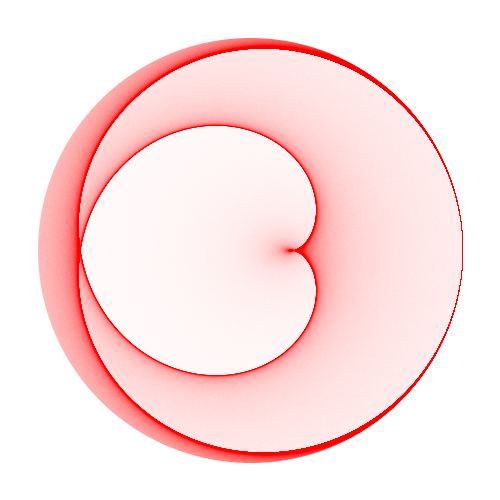
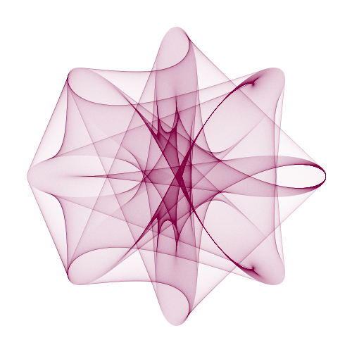

# Code examples

These code examples, written in Python,
demonstrate the basic algorithm described in the paper.
The scripts here are not optimized for speed and as a result are slow.
However, they are simple and should help intereted people to understand the algorithm
and possible ways to use it.
Implementing the algorithm in a language such as C/C++ will improve rendering speeds.

In order to run the code, you will need Python 3.6 or 3.7.  You also
need to install the NumPy and Pillow libraries. The files are

* **genImage_01.py** : Computes data for a circle where k = 2 and number of samples is 1,000,000 and 100,000,000.  The smaller value allows an image to render faster, but the result contains more noise.
  * k = 2, samples=100,000  
  * k = 2, samples=100,000,000  
* **genImage_02_A.py** : Computes data for a circle where k = 1.5 and number of samples is 1,000,000. The image result seems like it is only half drawn.
  * 
* **genImage_02_B.py** : Also computes data for a circle where k = 1.5 and number of samples is 1,000,000. However, two values for k are used, kA = 3 and kB = 2.  Allows the entire image to be rendered.
  * 
* **genImage_03.py** : Most complex example.  Due to the high number of points, a lot of computation is required.  However, it is simple computation that can be parallized.  This example demonstrates a parallized approch using Python's multiprocessing module.  Other languages such as C/C++ would likely use threading to achieve the same result.  The number of processes is determined by the number of CPUs on the computer running the code.
  * kA = 4 and kB = 7. Total number of samples=100,000,000. 10 processes with 10,000,000 samples / process.  
* **genImage_04.py** : Computes an image using the rose curve.
  * 
* **genImage_05.py** : Computes an image using the lemniscate curve.
  * 
* **genImage_06.py** : Computes an image using two curves, a circle and a rose curve.  For each line segment, point A is on the circle and connects to point B on the rose.
  * 
* **helper.py** : helper functions for saving data to a PNG file, and parametric equations for several curves

The scripts are not bullet proof and some combinations of values will cause the code to crash.  Playing with values,
especially the radii will usually fix most problems.
